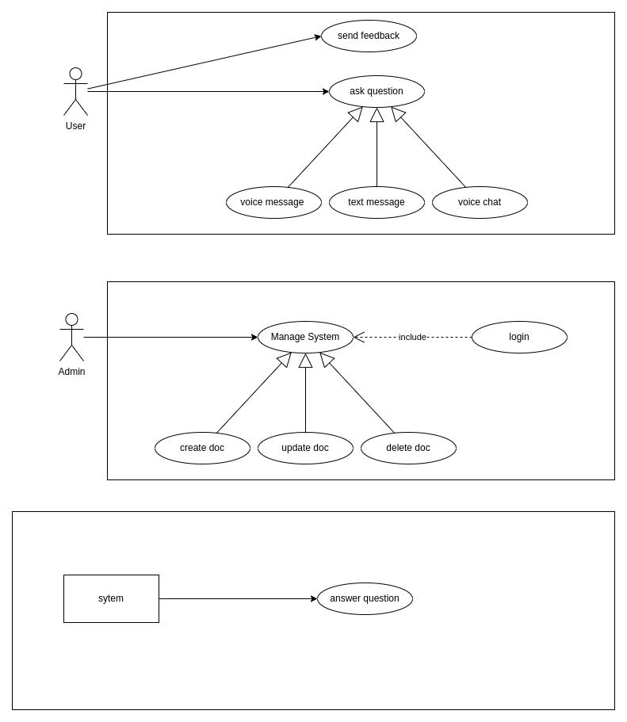
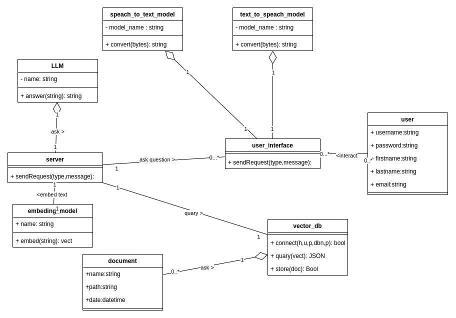
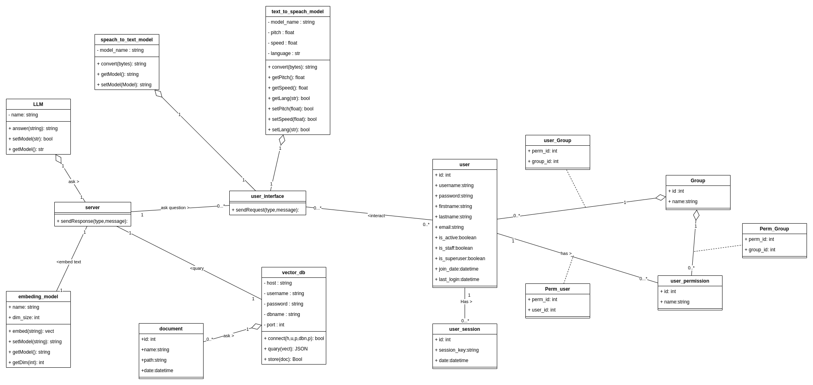
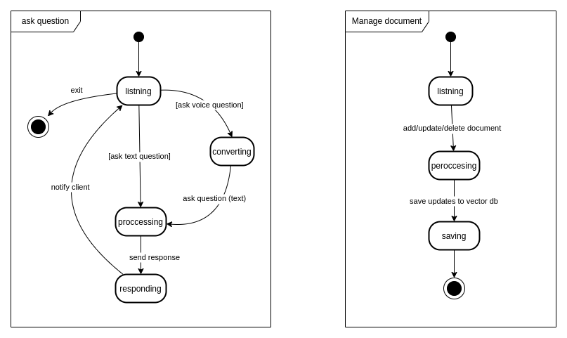
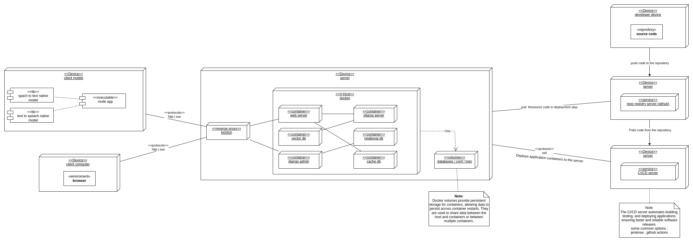

# Software Engineering Project Documentation

**by :** Amar Abdeldjalil Bouakaz

**project ID :** 13

## Project Overview

This project involves the development of a chatbot system capable of interacting with users, processing their queries, and providing meaningful responses. The chatbot integrates natural language processing and text-to-speech features, ensuring an intuitive user experience. The documentation includes UML diagrams, textual descriptions, and the architectural overview of the system.

---

## Table of Contents
1. [Use Case Diagram](#use-case-diagram)
2. [Analysis Class Diagram](#analysis-class-diagram)
3. [Class Diagram](#class-diagram)
4. [State-Action Diagram](#state-action-diagram)
5. [Deployment Diagram](#deployment-diagram)
6. [Dependency Diagram](#dependency-diagram)
7. [Component Diagram](#component-diagram)

---

## Use Case Diagram

### Use Case Diagram

### Textual Description

#### Actors:
- **User**: Interacts with the chatbot for queries or tasks.
- **Administrator**: Manages system configurations and documents.

#### Use Cases:
1. **Query Chatbot**
   - Description: The user interacts with the chatbot to ask questions or get information.
   - Actor: User
   - Precondition: The chatbot system is operational.
   - Steps:
     1. User submits a query.
     2. Chatbot processes the query.
     3. Chatbot provides a response.
   - Postcondition: The user receives a response.

2. **Manage System**
   - Description: The administrator manages the chatbot system (e.g., uploading documents, managing users).
   - Actor: Administrator
   - Precondition: The administrator has access rights.
   - Steps:
     1. Administrator logs in.
     2. Administrator performs the required action.
   - Postcondition: The system is updated.

---

## Analysis Class Diagram

### Diagram

### Description
The conceptual class diagram identifies the high-level components and their relationships:
- **User**: Represents the individual interacting with the chatbot.
- **User Interface**: Acts as the bridge between the user and the server.
- **Server**: Processes queries and coordinates backend components.
- **Document**: Represents knowledge sources.
- **Language Model**: Generates responses and interprets queries.
- **Embedding Model**: Encodes text for semantic understanding.
- **Vector Database**: Stores and retrieves vectorized information.
- **Text-to-Speech Model** and **Speech-to-Text Model**: Handle audio input and output.

---

## Class Diagram

### Diagram

### Description
The class diagram provides implementation-level details, defining attributes and methods for each class. The key components include:
- **User**: Manages user-related information (e.g., username, password).
- **Server**: Processes user requests using methods like `sendRequest(type, message)`.
- **Language Model**: Generates responses with `answer(string)` and manages models with `setModel(str)`.
- **Vector Database**: Handles database connections, queries, and storage.

---

## State-Action Diagram

### Diagram

The state-action diagram captures the dynamic behavior of the chatbot system. It consists of two primary actions:

1. **Ask Question**:
   - **Listening**: The system waits for user input, either in text or voice.
   - **Converting**: For voice input, the system converts speech to text.
   - **Processing**: Analyzes the query and prepares a response.
   - **Responding**: Sends the answer back to the user.

2. **Manage Document**:
   - **Listing**: The system lists the documents available for management.
   - **Processing**: Processes actions such as adding, updating, or deleting documents.
   - **Saving**: Updates the vector database to reflect the changes.

---

## Deployment Diagram

### Diagram

### Description
The deployment diagram illustrates the physical architecture of the system, including:
- **Client Devices**: Devices used by users to interact with the chatbot.
- **Dockerized Deployment Server**: Hosts the application logic and backend services within Docker containers for consistency and portability.
- **CI/CD Server**: automates testing , building , and deployment.
- **GitHub Repository Registry**: Stores the application code and manages version control.

---

## Dependency Diagram

### Diagram

### Description
The dependency diagram highlights the dependencies between components, such as:
- **Server depends on Language Model** for query processing.
- **Embedding Model depends on Vector Database** for semantic search.

---

## Component Diagram

### Diagram

### Description
The component diagram provides a high-level view of system modules and their interactions, focusing on:
- **UI Module**: Handles user interaction.
- **Backend Module**: Processes requests and responses.
- **Database Module**: Manages data storage and retrieval.

