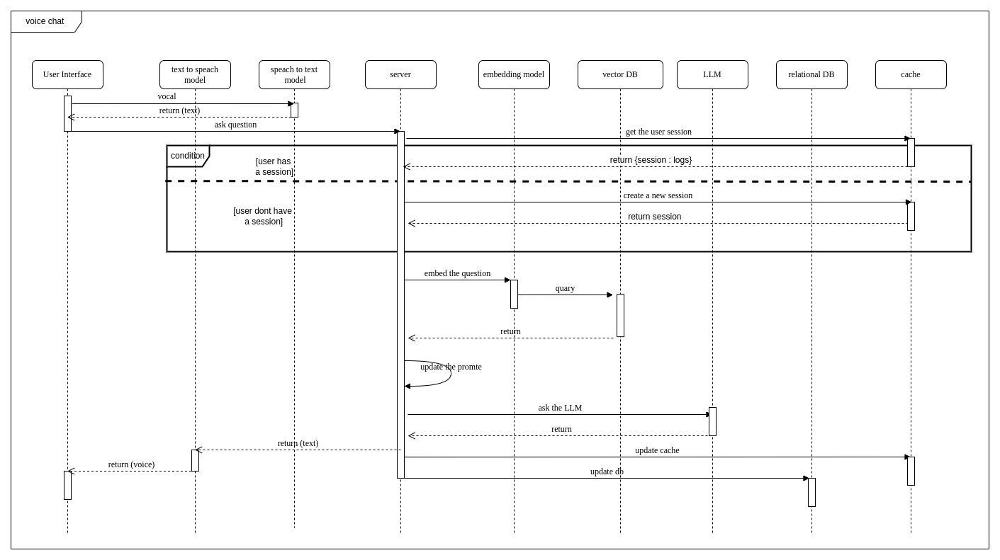
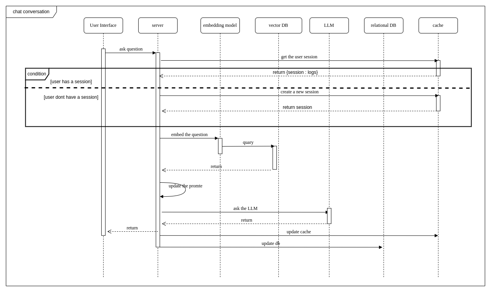
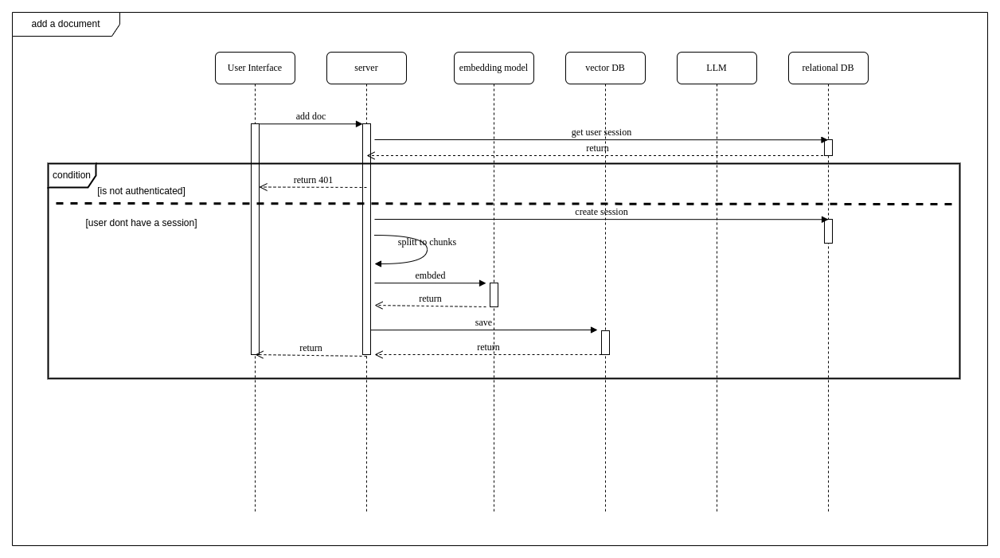

# Software Engineering Project Documentation

**by :** Amar Abdeldjalil Bouakaz

**project ID :** 13

---

## Table of Contents
- [Software Engineering Project Documentation](#software-engineering-project-documentation)
  - [Table of Contents](#table-of-contents)
  - [Project Overview](#project-overview)
  - [Use Case Diagram](#use-case-diagram)
    - [Diagram](#diagram)
    - [Textual Description](#textual-description)
      - [Actors](#actors)
      - [Use Cases](#use-cases)
  - [Sequence Diagram](#sequence-diagram)
    - [Diagrams](#diagrams)
    - [Description](#description)
  - [Analysis Class Diagram](#analysis-class-diagram)
    - [Diagram](#diagram-1)
    - [Description](#description-1)
  - [Class Diagram](#class-diagram)
    - [Diagram](#diagram-2)
    - [Description](#description-2)
  - [State-Action Diagram](#state-action-diagram)
    - [Diagram](#diagram-3)
    - [Description](#description-3)
  - [Deployment Diagram](#deployment-diagram)
    - [Diagram](#diagram-4)
    - [Description](#description-4)

---

## Project Overview

This project involves the development of a chatbot system capable of interacting with users, processing their queries, and providing meaningful responses. The chatbot integrates natural language processing and text-to-speech features, ensuring an intuitive user experience. The documentation includes UML diagrams, textual descriptions, and the architectural overview of the system.

---

## Use Case Diagram

### Diagram

### Textual Description

#### Actors
- **User**: Interacts with the chatbot for queries or tasks.
- **Administrator**: Manages system configurations and documents.

#### Use Cases
1. **Query Chatbot**
   - **Description:** The user interacts with the chatbot to ask questions or get information.
   - **Actor:** User
   - **Precondition:** The chatbot system is operational.
   - **Steps:**
     1. User submits a query.
     2. Chatbot processes the query.
     3. Chatbot provides a response.
   - **Postcondition:** The user receives a response.

2. **Manage System**
   - **Description:** The administrator manages the chatbot system (e.g., uploading documents, managing users).
   - **Actor:** Administrator
   - **Precondition:** The administrator has access rights.
   - **Steps:**
     1. Administrator logs in.
     2. Administrator performs the required action.
   - **Postcondition:** The system is updated.

---
## Sequence Diagram

### Diagrams

### Description

1. **Voice Chat :**
This sequence diagram describes the workflow when a user interacts with the chatbot via voice:
   - **User Interface**: The user sends a vocal query through the interface.
   - **Text-to-Speech Model**: Converts the voice input to text.
   - **Server**: Receives the text query and checks if the user has an active session. If no session exists, it creates a new one.
   - **Embedding Model**: Embeds the query to prepare it for vectorized semantic matching.
   - **Vector Database**: Queries the database for relevant information.
   - **LLM (Language Model)**: Processes the query and generates an appropriate response.
   - **Relational Database & Cache**: Updates the user session or other application states as required.
   - **Speech-to-Text Model**: Converts the text response back to speech for the user.
   - **Return to User**: The system responds to the user in voice format.

1. **Text Chat :**
This sequence diagram shows the flow when a user interacts with the chatbot using text (it's similar to the `Voice Chat seq diagram` but we dont need to convert between text and voice )

1. **Add documents:**
This sequence diagram explains the process of adding a new document to the knowledge base:
   - **User Interface**: The user provides a document to add to the system.
   - **Server**: Checks user(admin) authentication and active session. If the user is not authenticated, it returns an error.
   - **Embedding Model**: Processes the document by splitting it into chunks and embedding them for vectorized representation.
   - **Vector Database**: Stores the vectorized chunks for semantic search.
   - **Return to User**: Confirms that the document was successfully added, or returns an error if the operation fails.

---

## Analysis Class Diagram

### Diagram

### Description
The conceptual class diagram identifies the high-level components and their relationships:
- **User**: Represents the individual interacting with the chatbot.
- **User Interface**: Acts as the bridge between the user and the server.
- **Server**: Processes queries and coordinates backend components.
- **Document**: Represents knowledge sources.
- **Language Model**: Generates responses and interprets queries.
- **Embedding Model**: Encodes text for semantic understanding.
- **Vector Database**: Stores and retrieves vectorized information.
- **Text-to-Speech Model** and **Speech-to-Text Model**: Handle audio input and output.

---

## Class Diagram

### Diagram

### Description
The class diagram provides implementation-level details, defining attributes and methods for each class. The key components include:
- **User**: Manages user-related information (e.g., username, password) and the administration tasks.
- **Server**: Processes user requests using methods like `sendRequest(type, message)`.
- **Language Model**: Generates responses with `answer(string)`.
- **Vector Database**: Handles database connections, queries, and storage.

---

## State-Action Diagram

### Diagram

### Description
The state-action diagram captures the dynamic behavior of the chatbot system. It consists of two primary actions:

1. **Ask Question**:
   - **Listening**: The system waits for user input, either in text or voice.
   - **Converting**: For voice input, the system converts speech to text.
   - **Processing**: Analyzes the query and prepares a response.
   - **Responding**: Sends the answer back to the user.

2. **Manage Document**:
   - **Listing**: The system lists the documents available for management.
   - **Processing**: Processes actions such as adding, updating, or deleting documents.
   - **Saving**: Updates the vector database to reflect the changes.

---

## Deployment Diagram

### Diagram

### Description
The deployment diagram illustrates the physical architecture of the system, including:
- **Client Devices**: Devices used by users to interact with the chatbot.
- **Dockerized Deployment Server**: Hosts the application logic and backend services within Docker containers for consistency and portability.
- **CI/CD Server**: automates testing , building , and deployment.
- **GitHub Repository Registry**: Stores the application code and manages version control.

